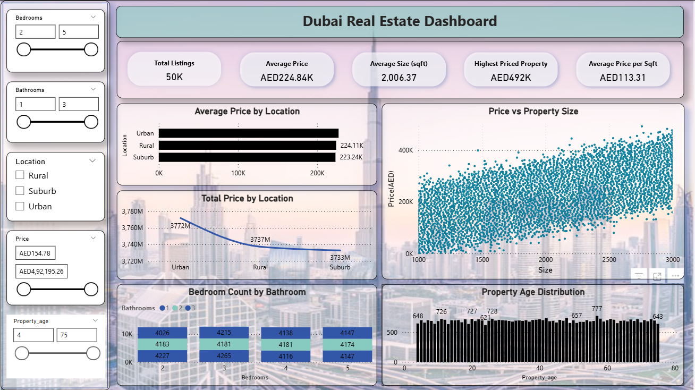

# 🏙️ Dubai Real Estate Intelligence Dashboard

An interactive and professional **Power BI dashboard** analyzing the Dubai housing market using property-level data. This project was built to uncover actionable insights for **investors, real estate agents, and policymakers** by exploring pricing patterns, property sizes, location trends, and market segmentation.

---

## 📊 Dashboard Preview

---

## 🎯 Project Objective

To design a high-level, interactive Power BI dashboard that helps users:

- Understand average price trends across location types
- Compare property size vs price visually
- Analyze bedroom/bathroom configurations and property age distributions
- Filter dynamically using slicers to drill into customized insights

---

## 🧠 Key Insights

- **Average Price**: AED 225K  
- **Average Property Size**: ~2,000 sqft  
- **Highest Priced Property**: AED 492K  
- **Urban areas** dominate both average and total property value  
- **2–4 bedroom** properties with **2 bathrooms** are the most common  
- Property listings span **5 to 75 years old**, with spikes around 20–30 years

---

## 🛠️ Tools & Technologies Used

| Tool | Purpose |
|------|---------|
| **Power BI** | Dashboard creation, DAX measures, visualization |
| **Power Query** | Data transformation and cleaning |
| **DAX** | Calculated columns & KPIs |
| **Microsoft Excel / CSV** | Dataset format |
| **GitHub** | Version control and project showcase |

---

## 📁 Dataset Summary

| Column | Description |
|--------|-------------|
| `Size` | Property size in sqft |
| `Price` | Selling price in AED |
| `Bedrooms` | Number of bedrooms |
| `Bathrooms` | Number of bathrooms |
| `Location` | Area type: Urban, Suburb, Rural |
| `Year_Built` | Construction year |
| `Property_Age` | 2025 - Year Built |
| `Price_per_sqft` | Price divided by size |

---

## 📌 Dashboard Features

- ✅ Dynamic KPI cards
- ✅ Bar, Line, TreeMap, and Scatter visuals
- ✅ Interactivity via slicers (Bedrooms, Bathrooms, Location, Price, Age)
- ✅ Clean layout and professional color theme
- ✅ Currency formatted in **AED**

---

## 🗂️ File Structure

📁 Dubai-House-Price-Dashboard/
├── README.md
├── Dubai Real Estate Dashboard.pbix
├── housing_price_dataset.csv
├── Dubai Real Estate Dashboard.png
├── Buildings-in-Dubai.jpg
├── DUBAI House Price.docx
├── DUBAI HOUSE PRICE.pptx
├── Dubai Real Estate Dashboard Overview 📊.mp4

---

## 🗣️ Voiceover Walkthrough

Check out the [🎥 full video walkthrough]

---

## 📬 Contact

**Ronak Ambu Patel**  
📫 [LinkedIn](www.linkedin.com/in/ronak-patel1790)  
📁 [GitHub](https://github.com/ronak171990)

---

## ⭐ If you found this project useful, don’t forget to give it a ⭐ and follow me on GitHub!
